# 📘 Guia d’Ús Tècnica: Bitwarden per a l’Equip Tècnic

Aquesta guia descriu els passos essencials per instal·lar, configurar i utilitzar Bitwarden com a gestor de contrasenyes dins d’un entorn tècnic. Inclou instruccions pas a pas i recomanacions de seguretat.

---

## 🔧 1. Instal·lació i Configuració Inicial

### 1.1 Descàrrega
Accedeix a [bitwarden.com/download](https://bitwarden.com/download) per descarregar l’última versió de Bitwarden per al teu dispositiu.

També pots accedir directament a la [aplicació web](https://vault.bitwarden.com) des de qualsevol navegador i gestionar les teves contrasenyes sense necessitat d’instal·lar res.

- Aplicació d’escriptori (Windows, macOS, Linux)
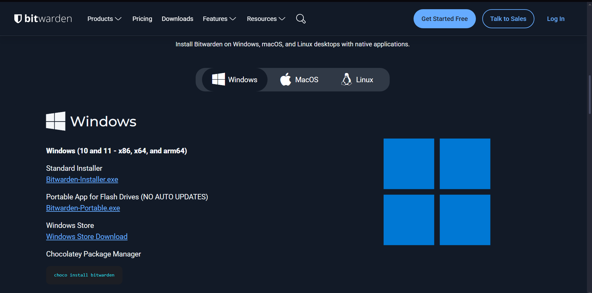
- Aplicació mòbil (Android, iOS)
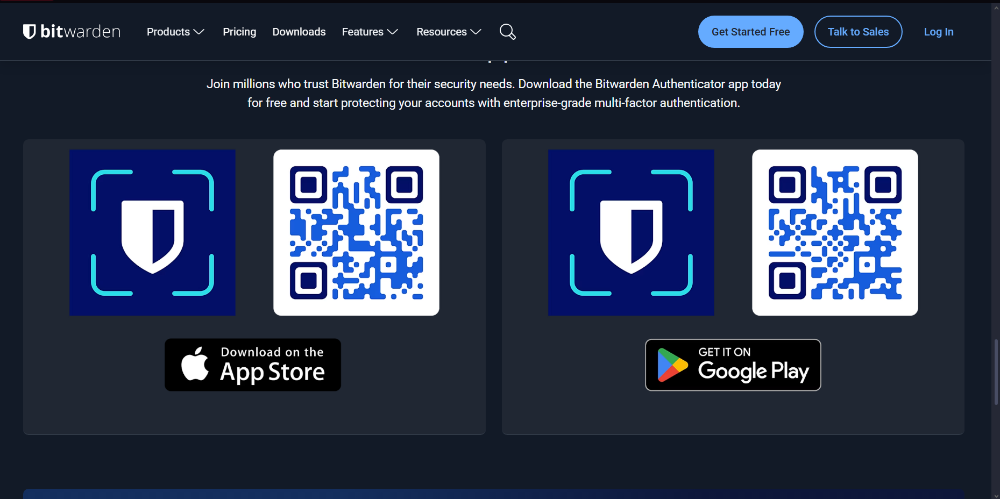
- Extensió de navegador (Chrome, Firefox, Edge)
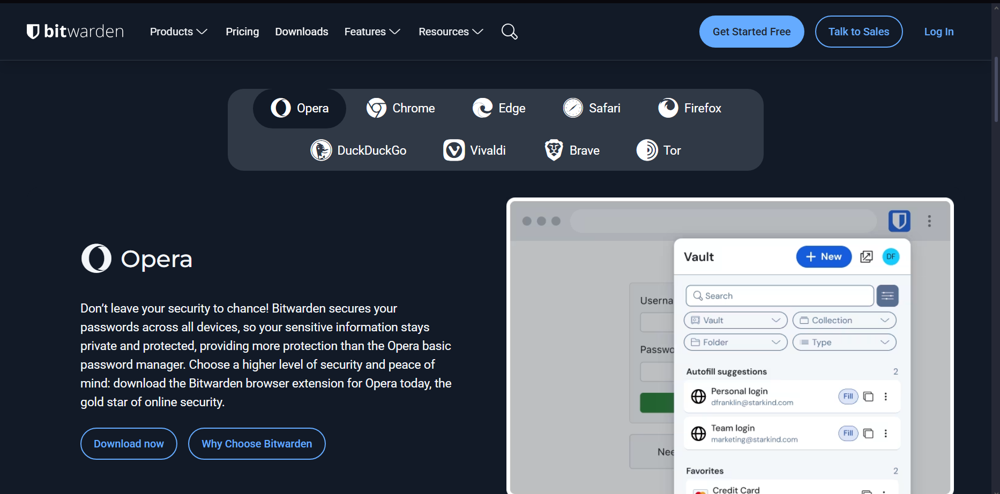
- Aplicació web (en línia)
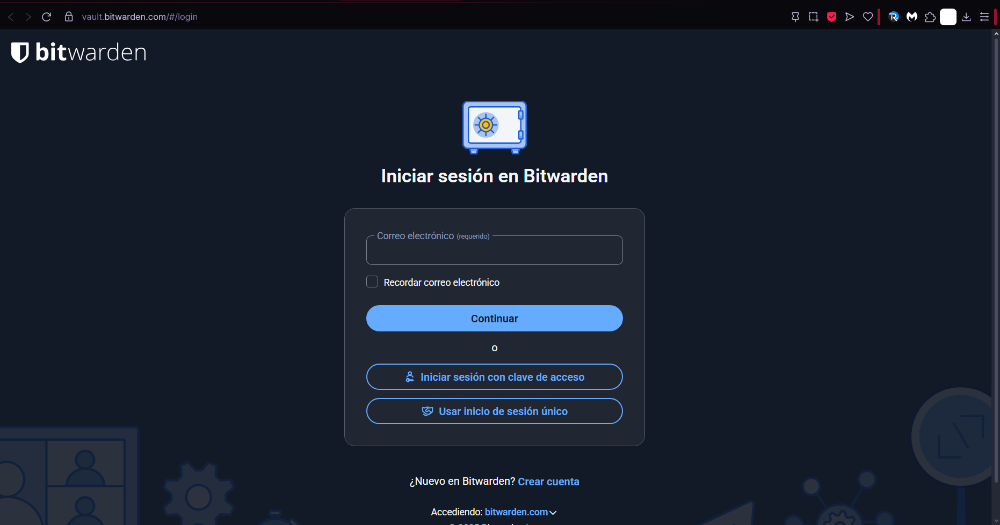

### 1.2 Instal·lació  
Per a aquesta guia, escollirem la instal·lació de l’extensió de Bitwarden per al navegador.

Només cal que accedeixis a la botiga oficial d’extensions del teu navegador (per exemple, Chrome Web Store, Firefox Add-ons, Edge Add-ons), cerquis "Bitwarden" i facis clic a "Afegir" o "Instal·lar".

La instal·lació és automàtica i veureàs un icona nou a la barra d’eines del navegador per accedir-hi fàcilment.

Finalment, inicia sessió en l’extensió amb les teves credencials de Bitwarden per començar a utilitzar-la.

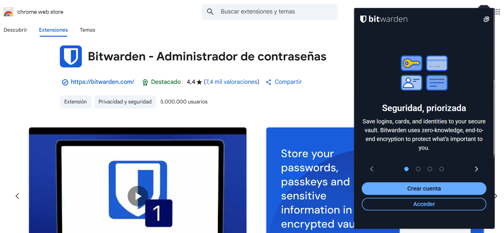

### 1.3 Creació del compte mestre
- Fes clic a **"Crear compte"**
- Introdueix el correu electrònic, el nom, una contrasenya mestra segura i una pista de recordatori

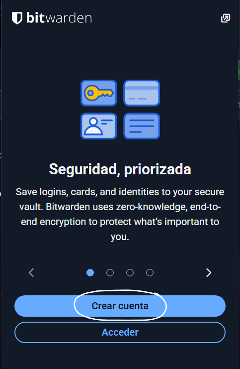

---

## 🔐 2. Generació de Contrasenyes Segures

Bitwarden inclou un generador integrat que permet crear contrasenyes o frases de pas robustes.

### 2.1 Accés al generador
- A l’aplicació o extensió, fes clic a **"Generador de contrasenyes"**

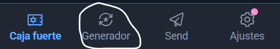

### 2.2 Paràmetres configurables
- Longitud recomanada: mínim 16 caràcters  
- Opcions disponibles: majúscules, minúscules, números i caràcters especials  
- També pots generar frases de pas (passphrases)

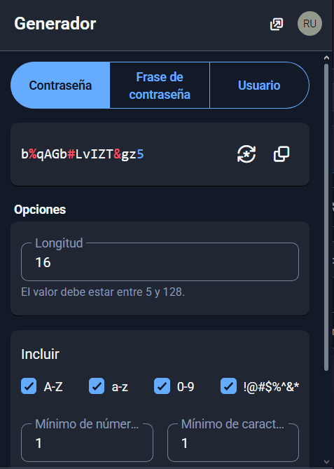

---

## 🧪 3. Exemples d’Ús i Emplenament Automàtic

### 3.1 Desar una credencial de correu electrònic
- Crea un nou element → Tipus: **Login**
- Nom: "Compte Gmail"
- URL: `https://mail.google.com`
- Introdueix l’usuari i la contrasenya corresponents

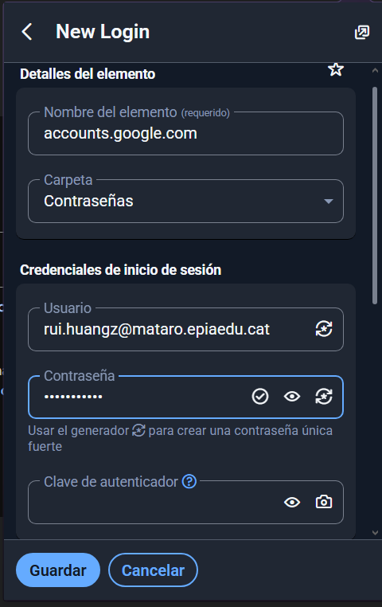

### 3.2 Desar una credencial d’aplicació o servei web
- Repeteix el procés anterior, modificant el nom i la URL segons el servei (p. ex. GitHub, Moodle)

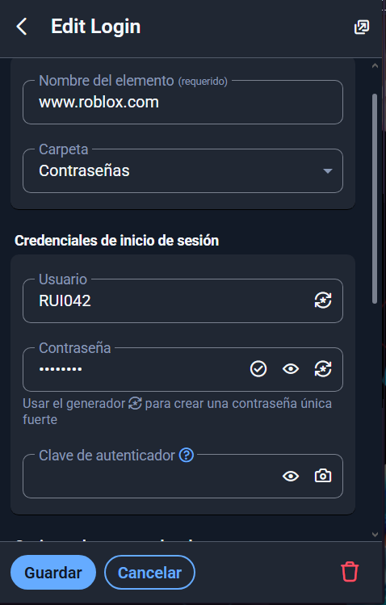

### 3.3 Emplenament automàtic amb l’extensió
- Instal·la l’extensió del navegador  
- Inicia sessió al teu compte Bitwarden  
- Accedeix a un lloc web amb credencials guardades  
- Bitwarden oferirà l’opció d’emplenar automàticament els camps

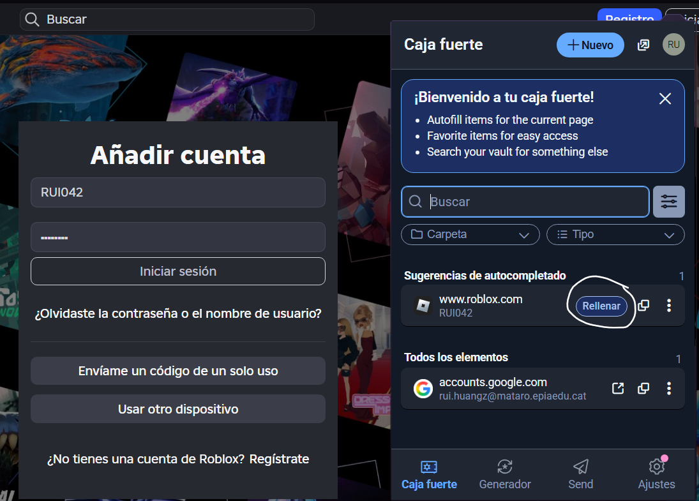

---

## 💾 4. Gestió de Còpies de Seguretat (Backup)

### 4.1 Exportació de la base de dades
- A l’aplicació web: Configuració → Eines → **Exportar Vault**
- Format recomanat: `.json` (xifrat si es desitja)

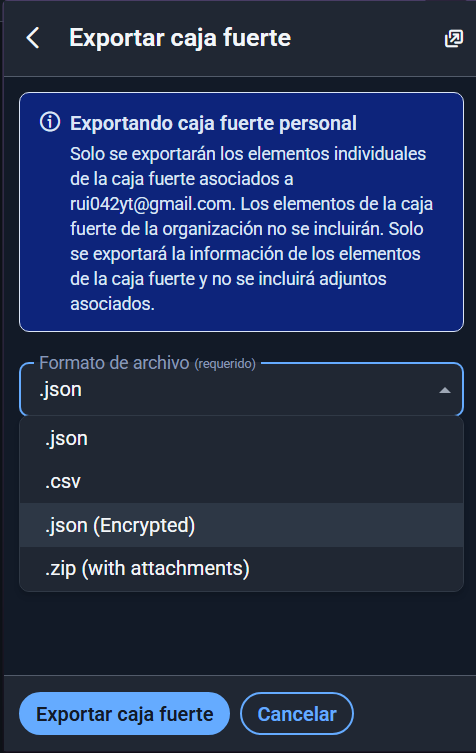

### 4.2 Recomanacions de seguretat
- No deixis l’arxiu exportat sense xifrar  
- Desa’l en ubicacions segures, com ara:
  - Una clau USB xifrada  
  - Un servei d’emmagatzematge al núvol amb xifrat (p. ex. Tresorit, Proton Drive)

**Nota:** Si no disposes d’una clau USB xifrada ni d’un servei de núvol amb xifrat end-to-end, considera utilitzar eines de xifrat manual com VeraCrypt o adquirir serveis especialitzats en emmagatzematge segur, per protegir les teves dades. En cas contrari, guarda la còpia en un lloc físic segur i restringit.

---

## ✅ Conclusions

Bitwarden és una eina segura, transparent i fàcil d’utilitzar per a la gestió de contrasenyes. Aquesta guia proporciona una base sòlida perquè l’equip tècnic el pugui implementar correctament i protegir les credencials de manera eficaç. 
---
[Tornar enrere](./README.md)
